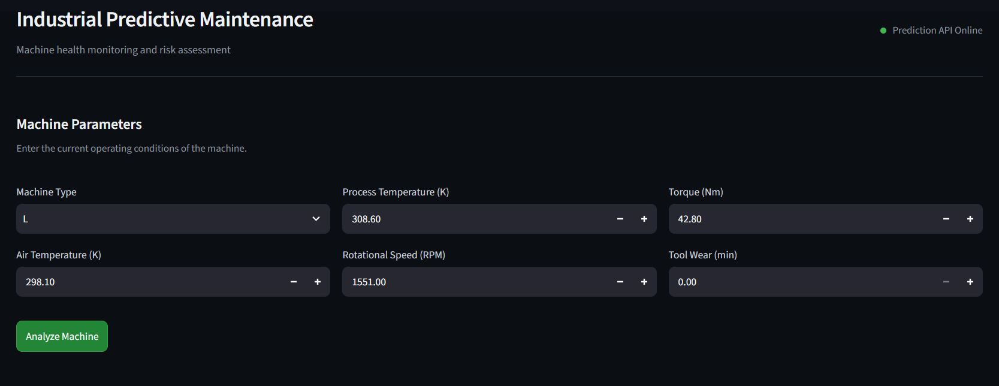
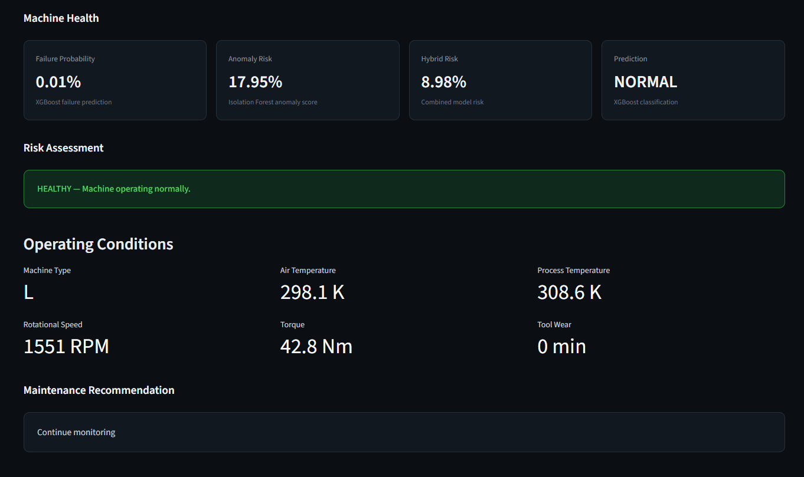
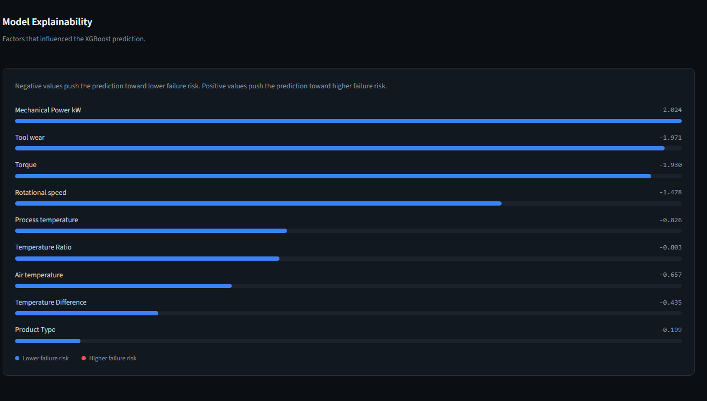
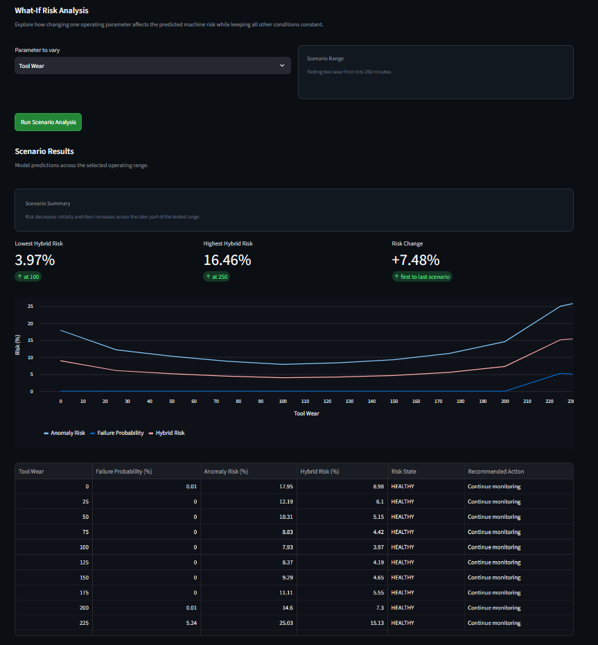
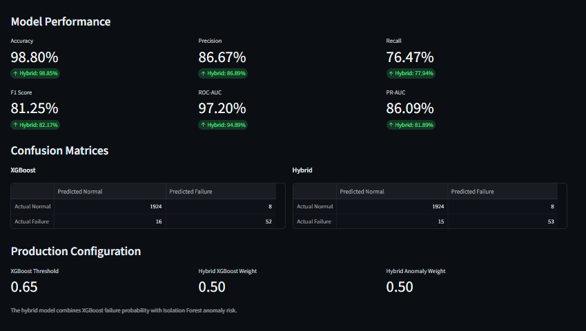

# Industrial Predictive Maintenance

An end-to-end predictive maintenance system built with **Python**, **XGBoost**, **Isolation Forest**, **SHAP**, **FastAPI**, and **Streamlit**. The system predicts machine failure probability, detects anomalous operating conditions, combines both signals into a hybrid maintenance risk score, explains predictions using SHAP, and provides interactive what-if scenario analysis through a production-style dashboard.

[](https://industrial-predictive-maintenance-fsfkyrzycxphc6xnzqpo6k.streamlit.app/)


---

## Overview

Unexpected machine failures can result in production downtime, maintenance costs, and operational losses.

This project develops an predictive maintenance system that analyzes machine operating conditions and estimates the likelihood of machine failure before it occurs.

The system combines **supervised machine learning** and **unsupervised anomaly detection**:

- **XGBoost** predicts machine failure probability
- **Isolation Forest** identifies anomalous operating conditions
- A **Hybrid Risk Engine** combines both signals
- **SHAP** explains individual predictions
- **What-If Analysis** explores how parameter changes affect risk
- **FastAPI** provides a prediction API
- **Streamlit** provides an interactive monitoring dashboard

The project is designed as an end-to-end machine learning system rather than only a model-training notebook.

---

# Features

## Machine Failure Prediction

- XGBoost-based machine failure prediction
- Failure probability estimation
- Configurable production threshold
- Class imbalance handling
- Production model evaluation

---

## Anomaly Detection

- Isolation Forest-based anomaly detection
- Normalized anomaly risk score
- Detection of unusual machine operating conditions
- Integration with the predictive maintenance pipeline

---

## Hybrid Risk Assessment

The system combines:

- XGBoost failure probability
- Isolation Forest anomaly risk

to produce:

- Hybrid risk score
- Machine risk state
- Maintenance recommendation

The production configuration uses equal weighting between the two signals.

---

## What-If Scenario Analysis

The dashboard allows users to investigate how changing a machine parameter affects its predicted risk.

For example:

```text
Tool Wear
    ↓
0 → 50 → 100 → 150 → 200 → 250
```
Each scenario is passed through the **complete prediction pipeline** and produces:

- Failure probability
- Anomaly risk
- Hybrid risk
- Risk state
- Recommended action

The results can be used to understand how changes in machine operating conditions influence overall maintenance risk.

---

## Interactive Dashboard

The Streamlit dashboard provides:

- Machine parameter input
- Machine health assessment
- Risk assessment
- Operating conditions
- Maintenance recommendation
- SHAP explainability
- What-if analysis
- Scenario visualization
- Model performance
- Confusion matrices
- Production configuration

---

## REST API

FastAPI provides endpoints for:

- Health checking
- Machine prediction
- Input validation
- Structured prediction responses

---

# Screenshots

## Dashboard


---

## Machine Health


---

## SHAP Explainability


---

## What-If Analysis


---

## Model Performance


---

# Dataset

The project uses the **AI4I 2020 Predictive Maintenance Dataset**.

The dataset contains **10,000 machine observations** with:

- Machine type
- Air temperature
- Process temperature
- Rotational speed
- Torque
- Tool wear
- Machine failure
- Failure-mode indicators

### Class Distribution

ClassSamplesPercentageNormal9,66196.61%Failure3393.39%

The dataset is highly imbalanced, making metrics such as **Precision, Recall, F1 Score, ROC-AUC, and PR-AUC** important when evaluating the model.

---

# How It Works

```text
Machine Parameters
        ↓
Feature Engineering
        ↓
 ┌───────────────┐
 │               │
XGBoost     Isolation Forest
 │               │
 ↓               ↓
Failure       Anomaly
Probability    Risk
 │               │
 └───────┬───────┘
         ↓
    Hybrid Risk
         ↓
   Risk Assessment
         ↓
 ┌───────┼────────┐
 ↓       ↓        ↓
SHAP   What-If   Maintenance
       Analysis  Recommendation
```

## Prediction Pipeline

1. Machine parameters are received
2. Engineered features are calculated
3. XGBoost estimates failure probability
4. Isolation Forest calculates anomaly risk
5. Both signals are combined
6. A hybrid risk score is calculated
7. The machine is assigned a risk state
8. A maintenance recommendation is generated
9. SHAP explains the prediction
10. Results are displayed through the dashboard or API

---

# Risk Assessment

The prediction service converts model outputs into an operational machine health assessment.

The system provides:

- Failure probability
- Predicted failure
- Anomaly risk
- Hybrid risk
- Risk state
- Recommended maintenance action

Example:

```text
Failure Probability : 0.0058%
Anomaly Risk        : 17.95%
Hybrid Risk         : 8.98%
Risk State          : HEALTHY
Action              : Continue monitoring
```

The final recommendation is based on the combined model assessment rather than relying only on the binary XGBoost prediction.

---

# SHAP Explainability

SHAP is used to explain individual machine predictions.

The system identifies which features contribute most strongly to the prediction.

Example features include:

- Mechanical Power kW
- Tool Wear
- Torque
- Rotational Speed
- Process Temperature
- Temperature Ratio
- Air Temperature
- Temperature Difference
- Product Type

This provides an interpretable view of why the model assigns a particular risk level to a machine.

---

# What-If Analysis

The system includes interactive scenario analysis for machine parameters.

Instead of manually changing machine parameters and running predictions repeatedly, the scenario engine automatically evaluates a predefined range of values.

For example:

```text
Tool Wear = [0, 50, 100, 150, 200, 250]
```

For every value, the system calculates:

- Failure Probability
- Anomaly Risk
- Hybrid Risk
- Risk State
- Recommended Action

The results are displayed as both a table and visualization.

This allows users to explore how machine risk changes across different operating conditions.

---

# Model Performance

## XGBoost

MetricScoreAccuracy**98.80%**Precision**86.67%**Recall**76.47%**F1 Score**81.25%**ROC-AUC**97.20%**PR-AUC**86.09%**

### Confusion Matrix

```text
[[1924, 8],
 [16, 52]]
```

---

## Hybrid Model

MetricScoreAccuracy**98.85%**Precision**86.89%**Recall**77.94%**F1 Score**82.17%**ROC-AUC**94.89%**PR-AUC**81.89%**

### Confusion Matrix

```text
[[1924, 8],
 [15, 53]]
```

---

## Model Comparison

The hybrid model improves threshold-based failure detection compared with the standalone XGBoost classifier.

### Recall

```text
76.47% → 77.94%
```

### F1 Score

```text
81.25% → 82.17%
```

The standalone XGBoost model retains higher ROC-AUC and PR-AUC, indicating stronger overall ranking performance.

The hybrid approach provides a different operational perspective by combining failure probability with anomalous machine behavior.

---

# API

The project provides a FastAPI backend for machine predictions.

## Health Check

```text
GET /health
```

Example response:

```json
{
  "status": "healthy",
  "service": "industrial-predictive-maintenance"
}
```

---

## Prediction

```text
POST /predict
```

Example request:

```json
{
  "type": "L",
  "air_temperature": 298.1,
  "process_temperature": 308.6,
  "rotational_speed": 1551,
  "torque": 42.8,
  "tool_wear": 0
}
```

Example response:

```json
{
  "failure_probability": 0.000058,
  "predicted_failure": 0,
  "anomaly_risk": 0.179,
  "hybrid_risk": 0.090,
  "risk_state": "HEALTHY",
  "recommended_action": "Continue monitoring"
}
```

---

# Project Structure

```text
Industrial-predictive-maintenance/
│
├── api/
│   ├── __init__.py
│   └── main.py
│
├── dashboard/
│   └── app.py
│
├── models/
│   ├── anomaly_preprocessor.joblib
│   ├── isolation_forest.joblib
│   ├── model_config.json
│   └── xgboost_model.joblib
│
├── notebooks/
│   └── 01_predictive_maintenance_model.ipynb
│
├── src/
│   ├── data/
│   │   └── __init__.py
│   │
│   ├── evaluation/
│   │   ├── __init__.py
│   │   └── evaluator.py
│   │
│   ├── features/
│   │   ├── __init__.py
│   │   └── engineering.py
│   │
│   ├── models/
│   │   ├── __init__.py
│   │   ├── anomaly.py
│   │   ├── predictor.py
│   │   └── service.py
│   │
│   ├── scenarios/
│   │   ├── __init__.py
│   │   └── simulator.py
│   │
│   └── utils/
│       ├── __init__.py
│       └── config.py
│
├── tests/
│   ├── conftest.py
│   ├── test_api.py
│   ├── test_evaluation.py
│   ├── test_models.py
│   ├── test_scenario.py
│   ├── test_shap.py
│   └── test_shap_integration.py
│
├── .gitignore
├── README.md
└── requirements.txt
```

---

# Tech Stack

| Category | Technologies |
| --- | --- |
| Programming Language | Python 3.12 |
| Machine Learning | XGBoost, Scikit-learn |
| Anomaly Detection | Isolation Forest |
| Explainable AI | SHAP |
| Data Processing | Pandas, NumPy |
| API | FastAPI, Pydantic, Uvicorn |
| Dashboard | Streamlit |
| Visualization | Matplotlib |
| Model Persistence | Joblib |
| Testing | Pytest |
| Development | Jupyter Notebook |

---

# Installation

## Clone the Repository

```bash
git clone https://github.com/ankith0921/Industrial-predictive-maintenance.git
```

## Navigate to the Project

```bash
cd Industrial-predictive-maintenance
```

## Create a Virtual Environment

```bash
python -m venv .venv
```

## Activate the Virtual Environment

### Windows

```powershell
.venv\Scripts\Activate.ps1
```

### Linux / macOS

```bash
source .venv/bin/activate
```

## Install Dependencies

```bash
pip install -r requirements.txt
```

---

# Running the Application

## Start the FastAPI Backend

From the project root:

```bash
uvicorn api.main:app --reload
```

The API will be available at:

```text
http://127.0.0.1:8000
```

Interactive API documentation:

```text
http://127.0.0.1:8000/docs
```

---

## Start the Streamlit Dashboard

Open another terminal:

```bash
streamlit run dashboard/app.py
```

The dashboard will be available at:

```text
http://localhost:8501
```

---

# Model Evaluation

Run the production model evaluation:

```bash
python -m src.evaluation.evaluator
```

This evaluates:

- Production XGBoost model
- Hybrid predictive maintenance model

The evaluation reports:

- Accuracy
- Precision
- Recall
- F1 Score
- ROC-AUC
- PR-AUC
- Confusion Matrix

---

# Testing

Run the complete test suite:

```bash
pytest -v
```

Current result:

```text
16 passed
```

The test suite covers:

- FastAPI health endpoint
- Valid API prediction
- Invalid machine type
- Invalid temperature
- Invalid rotational speed
- Evaluation data validation
- XGBoost evaluation
- Confusion matrix validation
- Expected model performance
- Hybrid model evaluation
- Hybrid confusion matrix
- Hybrid recall comparison
- Scenario prediction
- Tool-wear scenario analysis
- SHAP integration

---

# About the Author

## Ankith Kanthyappa Nataraj

Computer Science Engineering Graduate with interests in:

- Artificial Intelligence
- Machine Learning
- Natural Language Processing
- Data Science
- Software Engineering

**GitHub**

https://github.com/ankith0921

**LinkedIn**

https://www.linkedin.com/in/ankith-kn-9b7a6329b

---

# License

This project is licensed under the **MIT License**.

See the `LICENSE` file for details.
